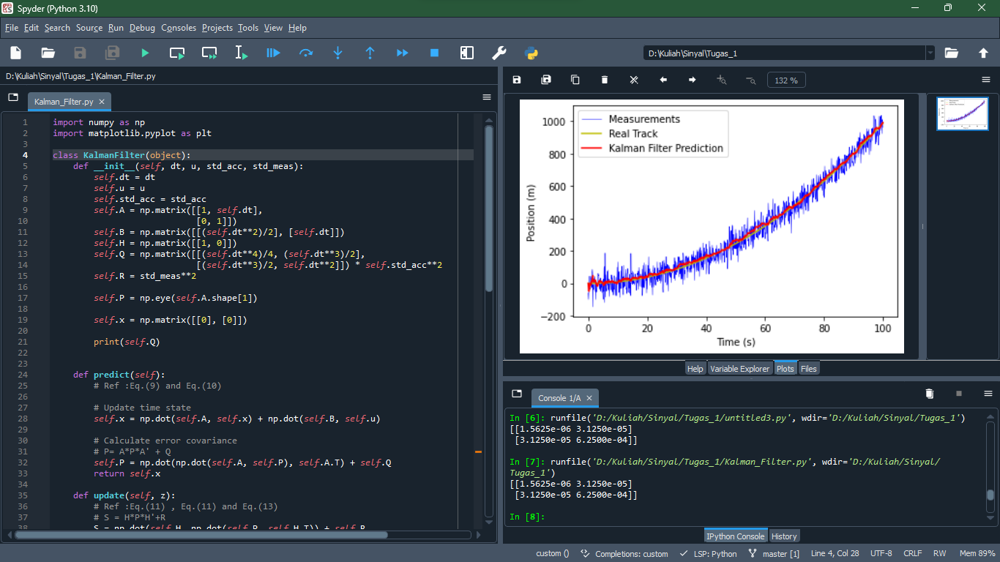

# Tugas 1 Sinyal: Git/Github & Python Preparation

### Set up Git/Github
Repository untuk tugas 1 dapat dilihat di sini 👉[🔴](https://github.com/Alfonsus-Enrico/TugasSinyal)

### A. IPython Console from Spyder showing Name and NRP
Print Nama & NRP di console

 
  <b>Gambar 1.</b> Print Nama & NRP di <em>Console</em>

### B. Result and Script on Spyder
Spyder Result of Kalman Filter for 1D Object Tracking

 
  <b>Gambar 2.</b> Kalman Filter untuk <em>Object Tracking</em> 1D

### C. Last Commit Logs

 
  <b>Gambar 3.</b> Commit Log

